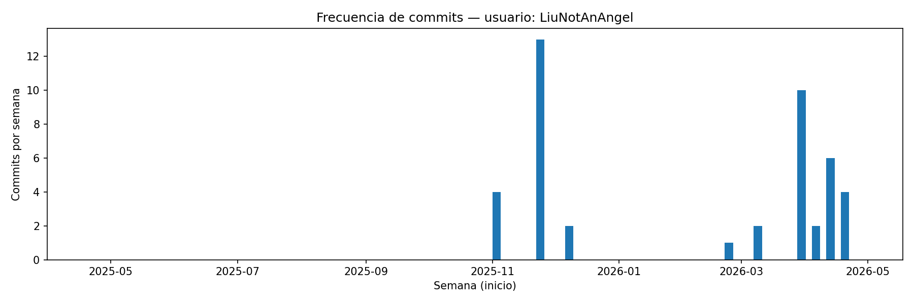

# ¡Hola! Soy Liu 👋

Bienvenido/a a mi perfil de GitHub. Me gusta construir cosas random y mejorar (?) un poquito cada día.

---

## Sobre mí

- 🌱 Actualmente estudiando en la **UIB**
- 🧑‍🍳 *Cooking* en las prácticas (a veces *overcook*, pero son casos excepcionales)

## Tecnologías

**Lenguajes:** C · Java · Python · JavaScript · HTML 

**Herramientas:**  GitHub · Docker (?)

> *Nota:* iré actualizando esta sección conforme vaya aprendiendo más.

---

## Actividad

---

## Contacto

- ✉️ Email: *liujiashengljs@gmail.com*

